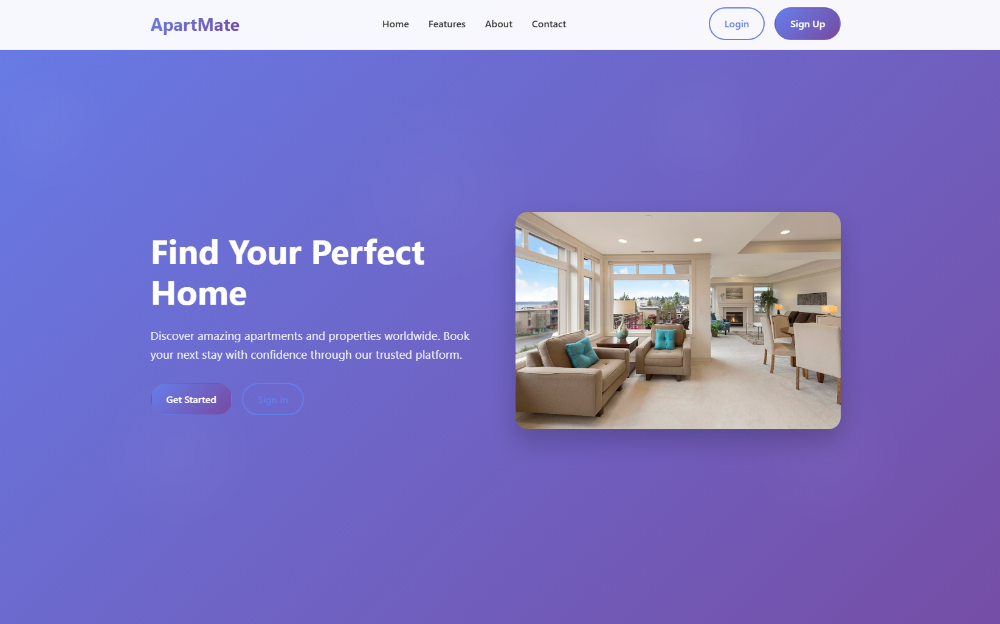

# Apartmate Web App

A Laravel-based web application for apartment management and roommate coordination.

## Screenshots

### Landing Page


### Login Page
.png)

### Registration Page
.png)

### Dashboard
.png)

## Table of Contents

- [Prerequisites](#prerequisites)
- [Installation](#installation)
- [Configuration](#configuration)
- [Database Setup](#database-setup)
- [Development](#development)
- [Project Structure](#project-structure)
- [Available Commands](#available-commands)
- [Testing](#testing)
- [Troubleshooting](#troubleshooting)

## Prerequisites

Before setting up the Apartmate application, ensure you have the following installed on your system:

### Required Software

- **PHP 8.2 or higher** with the following extensions:
  - BCMath PHP Extension
  - Ctype PHP Extension
  - cURL PHP Extension
  - DOM PHP Extension
  - Fileinfo PHP Extension
  - JSON PHP Extension
  - Mbstring PHP Extension
  - OpenSSL PHP Extension
  - PCRE PHP Extension
  - PDO PHP Extension
  - Tokenizer PHP Extension
  - XML PHP Extension

- **Composer** (PHP dependency manager)
- **Node.js 18+** and **npm** (for frontend assets)
- **Git** (for version control)

### Database Options

The application supports multiple database systems:
- **SQLite** (default, recommended for development)
- **MySQL 5.7+** or **MariaDB 10.3+**
- **PostgreSQL 10.0+**

### Development Environment (Optional)

For easier development, consider using:
- **Laragon** (Windows) - Already configured in this project
- **Laravel Sail** (Docker-based)
- **XAMPP** or **WAMP** (Windows)
- **MAMP** (macOS)

## Installation

### 1. Clone the Repository

```bash
git clone <repository-url>
cd apartmate
```

### 2. Install PHP Dependencies

```bash
composer install
```

### 3. Install Node.js Dependencies

```bash
npm install
```

### 4. Environment Configuration

Copy the environment example file and configure your settings:

```bash
cp .env.example .env
```

Edit the `.env` file with your specific configuration (see [Configuration](#configuration) section below).

### 5. Generate Application Key

```bash
php artisan key:generate
```

### 6. Database Setup

#### For SQLite (Default - Recommended for Development)

The SQLite database file is already created at `database/database.sqlite`. Run migrations:

```bash
php artisan migrate
```

#### For MySQL/PostgreSQL

1. Create a database for the application
2. Update your `.env` file with database credentials:

```env
DB_CONNECTION=mysql
DB_HOST=127.0.0.1
DB_PORT=3306
DB_DATABASE=apartmate
DB_USERNAME=your_username
DB_PASSWORD=your_password
```

3. Run migrations:

```bash
php artisan migrate
```

### 7. Build Frontend Assets

For development:
```bash
npm run dev
```

For production:
```bash
npm run build
```

### 8. Start the Development Server

```bash
php artisan serve
```

The application will be available at `http://localhost:8000`.

## Configuration

### Environment Variables

Key environment variables in `.env`:

```env
# Application
APP_NAME=Apartmate
APP_ENV=local
APP_KEY=base64:your_generated_key
APP_DEBUG=true
APP_URL=http://localhost:8000

# Database (SQLite - Default)
DB_CONNECTION=sqlite
DB_DATABASE=/path/to/database/database.sqlite

# Database (MySQL/PostgreSQL)
# DB_CONNECTION=mysql
# DB_HOST=127.0.0.1
# DB_PORT=3306
# DB_DATABASE=apartmate
# DB_USERNAME=root
# DB_PASSWORD=

# Session
SESSION_DRIVER=database
SESSION_LIFETIME=120

# Cache
CACHE_STORE=database

# Queue
QUEUE_CONNECTION=database

# Mail (for development)
MAIL_MAILER=log
```

### File Permissions

Ensure the following directories are writable:

```bash
chmod -R 775 storage
chmod -R 775 bootstrap/cache
```

## Database Setup

### Running Migrations

The application includes several migrations for core functionality:

```bash
# Run all pending migrations
php artisan migrate

# Rollback the last migration
php artisan migrate:rollback

# Reset all migrations
php artisan migrate:reset

# Fresh migration (drops all tables and re-runs migrations)
php artisan migrate:fresh
```

### Database Seeding

To populate the database with sample data:

```bash
php artisan db:seed
```

## Development

### Development Workflow

The project includes a convenient development command that runs multiple services simultaneously:

```bash
composer run dev
```

This command starts:
- Laravel development server
- Queue worker
- Log monitoring (Pail)
- Vite development server for frontend assets

### Available Commands

#### Laravel Artisan Commands

```bash
# Application
php artisan serve                 # Start development server
php artisan key:generate         # Generate application key
php artisan config:clear         # Clear configuration cache
php artisan cache:clear          # Clear application cache
php artisan view:clear           # Clear view cache
php artisan route:clear          # Clear route cache

# Database
php artisan migrate              # Run database migrations
php artisan migrate:status       # Show migration status
php artisan db:seed              # Run database seeders
php artisan tinker               # Interactive PHP shell

# Queue
php artisan queue:work           # Start queue worker
php artisan queue:listen         # Listen for queue jobs
php artisan queue:failed         # List failed jobs

# Testing
php artisan test                 # Run tests
composer run test               # Run tests with config clear
```

#### NPM Scripts

```bash
npm run dev          # Start Vite development server
npm run build        # Build assets for production
```

#### Composer Scripts

```bash
composer run dev     # Start all development services
composer run test    # Run tests with proper setup
```

## Project Structure

```
apartmate/
├── app/
│   ├── Http/Controllers/     # Application controllers
│   ├── Models/              # Eloquent models
│   └── Providers/           # Service providers
├── config/                  # Configuration files
├── database/
│   ├── migrations/          # Database migrations
│   ├── seeders/            # Database seeders
│   └── database.sqlite     # SQLite database file
├── public/                  # Web-accessible files
│   ├── css/                # Compiled CSS files
│   └── index.php           # Application entry point
├── resources/
│   ├── css/                # Source CSS files
│   ├── js/                 # JavaScript files
│   └── views/              # Blade templates
├── routes/
│   └── web.php             # Web routes
├── storage/                 # File storage and logs
├── tests/                   # Test files
└── vendor/                  # Composer dependencies
```

## Testing

### Running Tests

```bash
# Run all tests
php artisan test

# Run specific test file
php artisan test tests/Feature/ExampleTest.php

# Run tests with coverage
php artisan test --coverage
```

### Test Database

Tests use a separate SQLite database. The test environment is automatically configured when running tests.

## Troubleshooting

### Common Issues

#### 1. Permission Errors

```bash
# Fix storage permissions
chmod -R 775 storage bootstrap/cache
```

#### 2. Composer Memory Issues

```bash
# Increase memory limit
php -d memory_limit=2G /usr/local/bin/composer install
```

#### 3. Node.js Version Issues

Ensure you're using Node.js 18 or higher:

```bash
node --version
npm --version
```

#### 4. Database Connection Issues

- Verify database credentials in `.env`
- Ensure database server is running
- Check if database exists (for MySQL/PostgreSQL)

#### 5. Application Key Issues

```bash
# Regenerate application key
php artisan key:generate
```

#### 6. Cache Issues

```bash
# Clear all caches
php artisan config:clear
php artisan cache:clear
php artisan view:clear
php artisan route:clear
```

### Getting Help

If you encounter issues not covered here:

1. Check the Laravel documentation: https://laravel.com/docs
2. Review the application logs in `storage/logs/laravel.log`
3. Ensure all prerequisites are properly installed
4. Verify your environment configuration

### Development Tips

- Use `php artisan tinker` for interactive testing
- Monitor logs with `php artisan pail` or `tail -f storage/logs/laravel.log`
- Use `php artisan route:list` to see all available routes
- Check `php artisan config:show` to verify configuration values

---

## Contributing

1. Fork the repository
2. Create a feature branch
3. Make your changes
4. Run tests to ensure everything works
5. Submit a pull request

## License

This project is open-sourced software licensed under the [MIT license](https://opensource.org/licenses/MIT).